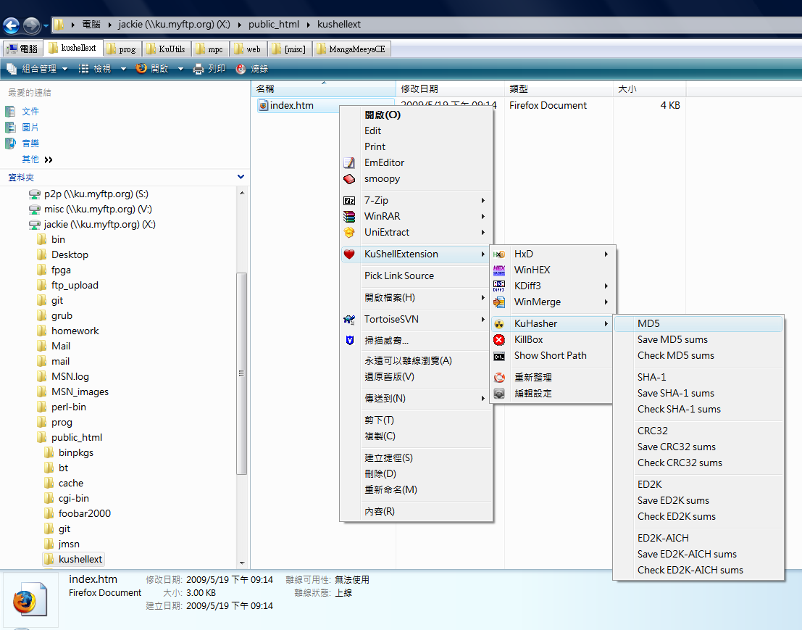
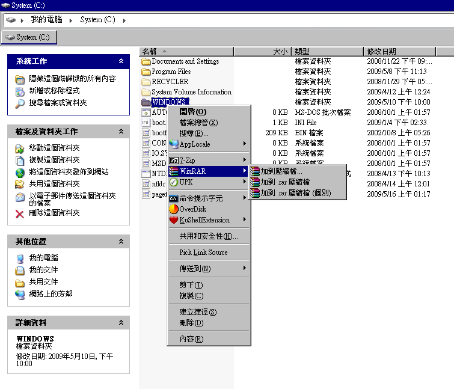

# KuShellExtension

KuShellExtension is a Windows shell extension which inserts custom entries into context menu (a.k.a. shell menu) in some applications like Windows Explorer - the standard file manager in Windows.

## Features

1.  It is highly configurable by a simple configuration file in XML format. This design enables the uses of scripting/automation environment, so it can be distributed to multiple computers easily.
2.  It can generate submenus and display icons, which cannot be done by simply modifying registry.
3.  It is designed to be as portable as possible, "portable" means it can be bring from one computer to another computer easily. Though it modifies the registry to register itself, but it doesn't save the settings there. This enables users use KuShellExtension in their USB drives.
4.  Unlike some similar solutions, it is written in C++, which doesn't require extra runtimes like .NET.
5.  Supports both x86 and x64 systems.
6.  Handles correctly passing multiple files to your executable, this is necesary for 7z and similar tools

Compatibility: KuShellExtension is tested in Windows XP (x86) and Windows 7 (x64).

## Download

Latest Version: https://github.com/badrelmers/KuShellExtension/releases

## Build

install visual studio 2010 or SDK 7.1, then run build_for_VS2010_or_SDK71.bat to build and create_release.bat to create a ready release folder with all the files

## Contribution

I'm not maintaining this tool, only bug fixes for windows 7, but PR's are welcome.

## Usage

- INSTALLTION: Unpack the archive and use the file install.cmd to register the DLLs. Then use your favorite text editor to open config.xml, and edit it by following [this guide](doc/Configuration.md) or simplly follow the comments in the xml file.

- UNINSTALLTION: Double click uninstall.cmd to unregister the shell extensions, and then delete the files. KuShellExtension doesn't put any additional files in your disk.

Require administrators' rights to install, because the modern systems only allow [approved shell extensions](https://web.archive.org/web/20120719072915/http://technet.microsoft.com/en-us/library/cc975946.aspx "http://technet.microsoft.com/en-us/library/cc975946.aspx") to run by default.

## Known issues

**Known Limitation: Symlink files and %w / %u behavior**

When a selected file is a symbolic link (symlink), Windows Explorer resolves the symlink to its target path _before_ passing file paths to shell extensions. This is a Windows Shell limitation that affects all shell extension–based tools, including 7-Zip.

**Effect on %w (working directory):** If the right-clicked file is a symlink — for example, `D:\ccc\file` pointing to `E:\file` — Windows reports the path as `E:\file`. As a result, `%w` expands to `E:\` (the target's folder) instead of `D:\ccc\` (the folder where the symlink resides). The same behavior affects 7-Zip and other tools that rely on the working directory reported by Windows.

**Effect on %u (file list):** If multiple files are selected and you right-click specifically on one of the symlinks in the selection, Windows discards the rest of the selection and passes only the resolved symlink target to the shell extension. As a result, the `%u` file list will contain only that one file instead of all selected files. Right-clicking on a non-symlink file in the same selection does not trigger this issue.

**Workaround for both issues:** Avoid right-clicking directly on a symlink file. Instead, right-click on any other normal (non-symlink) file in the selection. This causes Windows to report all selected file paths correctly, and `%w` / `%u` will behave as expected.

## Alternatives
- ShellAnything is a C++ open-source software which allow one to easily customize and add new options to *Windows Explorer* context menu. Define specific actions when a user right-click on a file or a directory.
	- similar to KuShellExtension 
	- NOTE: Version 0.7 is the last version of ShellAnything that supports Windows 7.
	- https://github.com/end2endzone/ShellAnything

- ContextMenuManager
	- win7+
	- GUI
	- usefull to add or clean entries easly
	- https://github.com/BluePointLilac/ContextMenuManager

## Authors
- 2008-2013: KuShellExtension is created by Kai-Chieh Ku. If you have some questions about this program, please feel free to send an e-mail to kjackie(gmail). Chinese, English, and Japanese mails are accepted. https://sourceforge.net/projects/kushellext/
- 2026: Badr Elmers - some bugs fixes.
